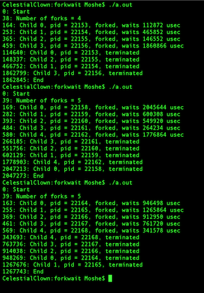

forkwait
========

An assignment demonstrating how forks work. It was assigned in my Workstation Programming course at Brooklyn College, CISC 3350.

The basic premise is that you have to spawn a random number of forks, make them sleep, and then "catch" them in the parent process.

I've had trouble running this when compiling this in Xcode, but using gcc from Terminal produces a program that operates correctly.

Here's a screenshot:

